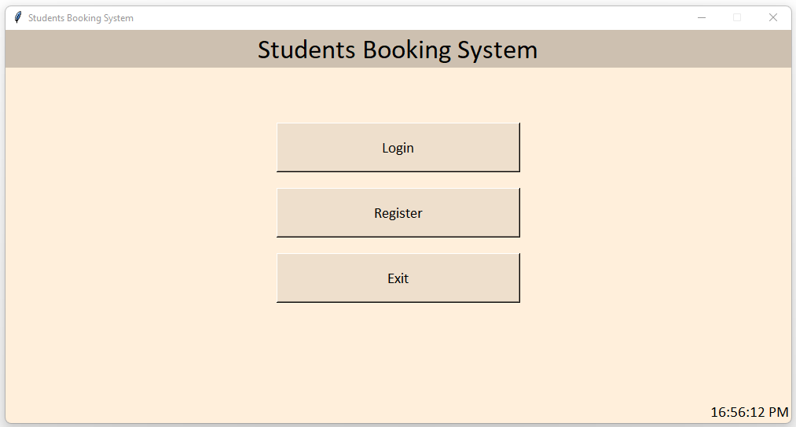
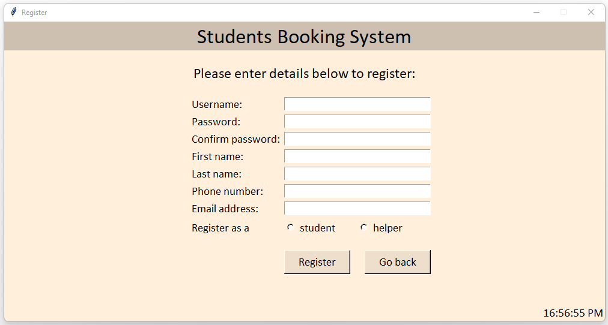
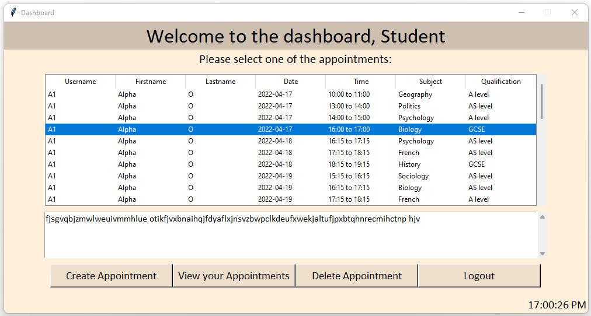
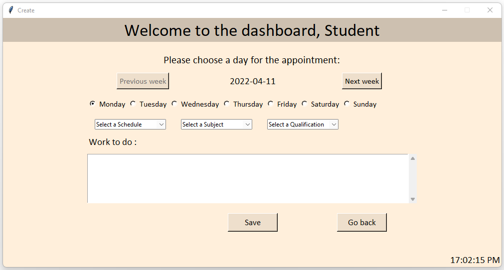
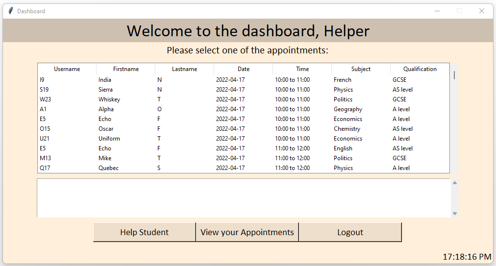
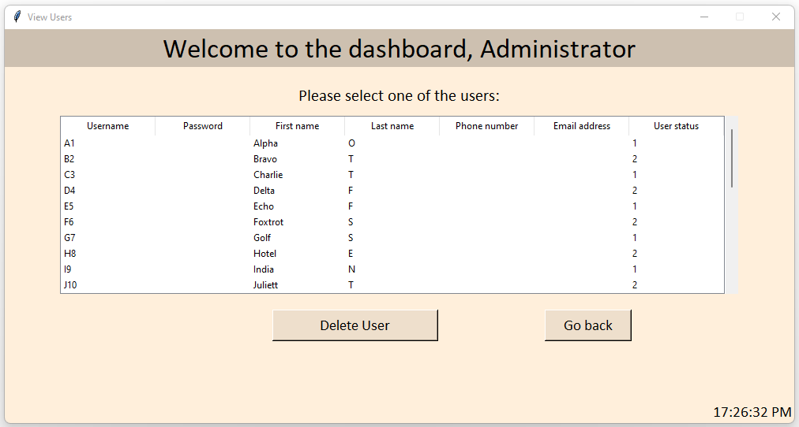

# Student booking system
(My old A level final project)  
A tool that allows students to book when and what time they will study at the bookstore/ study room as well as the subject they will need help with, so that Helpers can book a timeslot with the student to help them.

